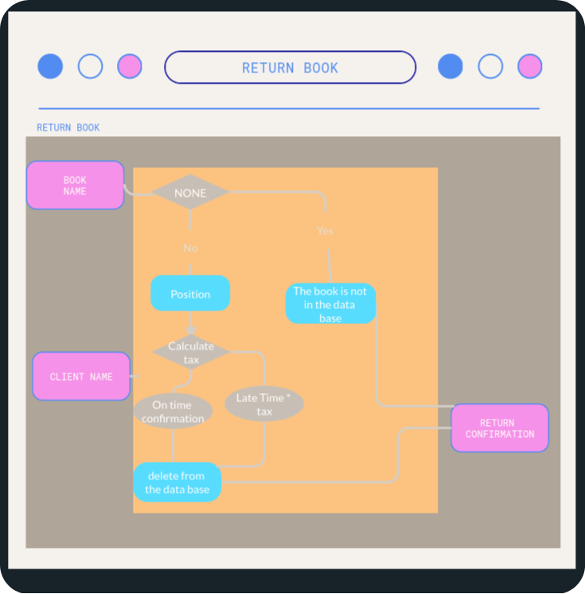

# __CI_PP3_LIBRARY__


Code institute Project portfolio 3 Library  ** CI_PP3_LIBRARY** is a website created specifically for library workers to use. where the staff can use a console application to access the database and make adjustments like rent, return a book for a client, and get the client's information.

 

- HTML 
"HTML is the standard markup language for documents designed to be displayed in a web browser. It can be assisted by technologies such as Cascading Style Sheets (CSS) and scripting languages such as JavaScript. [[1](https://en.wikipedia.org/wiki/HTML)] "

- CSS
"Cascading Style Sheets (CSS) is a style sheet language used for describing the presentation of a document written in a markup language such as HTML.
CSS is a cornerstone technology of the World Wide Web, alongside HTML and JavaScript.[[2](https://en.wikipedia.org/wiki/CSS)]"

- JS
"JavaScript, often abbreviated JS, is a programming language that is one of the core technologies of the World Wide Web, alongside HTML and CSS. As of 2022, 98% of websites use JavaScript on the client side for web page behavior, often incorporating third-party libraries. All major web browsers have a dedicated JavaScript engine to execute the code on users' devices. .[[3](https://es.wikipedia.org/wiki/JavaScript)]"

- Python 
"Python" is a high-level, interpreted, general-purpose programming language. Its design philosophy emphasizes code readability with the use of significant indentation.
Python is dynamically-typed and garbage-collected. It supports multiple programming paradigms, including structured (particularly procedural), object-oriented and functional programming. It is often described as a "batteries included" language due to its comprehensive standard library.[[3](https://en.wikipedia.org/wiki/Python_(programming_language))]


[Live web page](https://ci-pp3-lib.herokuapp.com/)

[Data base link](https://docs.google.com/spreadsheets/d/1DbyRwboTepMgfwkEzO9DnHFKomjpPq1epkJuvYWMPdY/edit?usp=sharing)


## __Table of Content__

1. [Project Goals](#project-goals)
    1. [User Goals](#user-goals)
    2. [Site Owner Goals](#site-owner-goals)
2. [User Experience](#user-experience-uxd)
    1. [Target Audience](#target-audience)
    2. [User Requirements and Expectations](#user-requirements-and-expectations)
    3. [User Stories](#user-stories)
3. [Design](#design)
    1. [Design Choices](#design-choices)
    2. [Colour](#colour)
    3. [Fonts](#fonts)
    4. [Structure](#structure)
    5. [Logical Design](#logical-design)
4. [Technologies Used](#technologies-used)
    1. [Languages](#languages)
    2. [Frameworks Libraries Tools](#frameworks-libraries-tools)
5. [Features](#features)
6. [Testing](#validation)
    1. [HTML Validation](#html-validation)
    2. [CSS Validation](#css-validation)
    3. [Python validation](#p8p-validation)
    4. [Accessibility](#accessibility)
    5. [Performance](#performance)
    6. [Browsers support](#browsers-support)
    7. [Testing user stories](#testing-user-stories)
8. [Bugs](#bugs)
9. [Deployment](#deployment)
    1. [Clone the code](#clone-the-code)
    2. [Fork the code](#fork-the-code)
    3. [Heroku](#Heroku)
    4. [Share the code](#share-the-code)
10. [Credits](#credits)
11. [Contributing](#contributing)
12. [License](#license)
13. [Acknowledgements](#acknowledgements)

## __Project Goals__

### __User Goals__

- Individuals in need of library management software.
- Secure the database with credentials.
- Make use of website services.
- Make renting and returning a book for a client simple.

### __Site Owner Goals__

- Take care of a database.
- Offer customers a simple and quick service.
- An easy-to-use interface for the workers to sign up for 

## __User Experience (UXD)__

### __Target Audience__

- Patrons of libraries.
- library employees.
- proprietors of libraries.

### __User Requirements and Expectations__

- Interactive and easy to understand page design.
- A straightforward and clear navigation.
- A program that integrates with Google Sheets as a database
- Streamline the routine tasks.
- External Links referenced to developer

### __User Stories__

#### __First-time User__
First time user:

1. Wants easy operation.
2. Has a desire to provide a service to customers.
3. Desires to assist a client with renting a book.
4. Wants access to credentials so they can secure the database.
5. Add a book to the database.
6. Experience fluid interaction.

#### __Returning User__
As a returning user, We want:

7. Research details for a client.
8. Return a book to the stock from a client.
9. Reload the page to fix interface issues in the future.

#### __Site Owner__
As the site owner, we want:

10. controll data base.
11. Simple database manipulation
12. An easy way to find the developer
13. Handling an interactive console.

## __Design__

### __Design Choices__

The website was created with the knowledge that Heroku would have difficulty deploying a user interface with particular libraries, thus a console interface with a fluid design was employed entirely to give the operator the impression that they were in an interactive environment.

### __Colour__

The color tones were chosen precisely to match the concept and to a simple and approachable design using the Visual Studio colors preset.

  

<br>

### __Fonts__

ROBOTO Font from GOOGLE. 
The most used on the majority of data flow.

<br>

### __Structure__

Following the principles of UXD (user experience design), the website structure was designed to be fluid and simple to operate.
The website was composed of a page with: 

- The Terminal, a template created by the Code Institute.
- The terminal's Refresh button 
- Fotter with social media developer

### __Logical Design__

#### Flowchart

Flowchart consist in A black box that contains all functions is divided into 4 sections in the flowchart.
The functions are made in 3 clear boxes that serve the following 3 purposes: rent book, return book, and client information.


<details><summary>Black Box</summary>
    
</details>

<details><summary>Rent Book</summary>
        
</details>
<details><summary>Return Book</summary>
        
</details>
<details><summary>Get client information</summary>
        
</details>


## __Technologies Used__

### __Languages__

- HTML5
- CSS
- Java Script
- Python

### __Frameworks Libraries Tools__

- Visual Studio Code
- Git
- GitHub
- Gitpod
- Visme
- Google Fonts
- W3schools
- Favicon.io
- ion icons
- Gspread
- Googlesheets
- Google Drive
- Google Api
- Pep8online
## __Features__

The page was made using a real-world business as a model(Library), having a reference to be operated by the staff. The goal was to manage the database as an item that could be read and changed.

### __Terminal__

An terminal interface where the staff can interactive with the program to do some tasks.
- User stories covered: 1,2,3,5,6,7,8,10,11

  


### __Reload Button__

Button with a Function to refresh the page and start again the terminal to fix some future issues.
- User stories covered: 9 

  

### __Footer__

The footer is a straightforward part the staff can know who was the developer of the sofware.
- User stories covered: 12 

 

## __Validation__

### __HTML Validation__

The Validator used was W3C Service to validate the HTML of the webpage, 
the entire project pass with no errors by use of some tools.

<details><summary>Validation</summary>

</details>

### __CSS Validation__

W3C's primary activity is to develop protocols and guidelines that guarantee long-term growth for the Web.
W3C's  determine key parts of what makes the World Wide Web activity.
W3C was used to validate the CSS style of the whole page

<details><summary>style.css</summary>

</details>


### __P8P Validation___

This validator is online PEP8 checker.
<details><summary>Validation </summary>

<details><summary>Main</summary>

</details>
<details><summary>Functions</summary>

</details>
<details><summary>test Functions</summary>

</details>
<details><summary>validation</summary>

</details>
</details>


### __Accessibility__

The WAVE WebAIM web accessibility evaluation tool was used to ensure the website met high accessibility standards. All pages pass with 0 errors.

<details><summary>Validation</summary>

</details>

### __Performance__

Google Lighthouse's Chrome Developer Tool was used to test the website's performance.

<details><summary>Validation</summary>

</details>

### __Browsers support__

| [](http://godban.github.io/browsers-support-badges/)<br/>IE / Edge | [](http://godban.github.io/browsers-support-badges/)<br/>Firefox | [](http://godban.github.io/browsers-support-badges/)<br/>Chrome | [](http://godban.github.io/browsers-support-badges/)<br/>Safari | [](http://godban.github.io/browsers-support-badges/)<br/>Opera |
| --------- | --------- | --------- | --------- | --------- |
| IE11, Edge| last 2 versions| last 2 versions| last 2 versions| last 2 versions

### __Testing user stories__
1. Wants easy operation.

| **Feature** | **Action** | **Expected Result** | **Actual Result** |
|-------------|------------|---------------------|-------------------|
|Actions are preceded by an instruction|Use options to guide the user| Order options| Works as well |

<details><summary>Console</summary>


</details>

2. Has a desire to provide a service to customers.

| **Feature** | **Action** | **Expected Result** | **Actual Result** |
|-------------|------------|---------------------|-------------------|
|Offer diferent functions to the user|three options : return, rent book and get client information| Execute functions| Works as well |

<details><summary>Functions</summary>

</details>

3. Desires to assist a client with renting a book.

| **Feature** | **Action** | **Expected Result** | **Actual Result** |
|-------------|------------|---------------------|-------------------|
|Offer a function to the user|save a client in data base with a book rented | Data base changed| Works as well |

<details><summary>Rent a book function</summary>
<details><summary>Step 1</summary>

</details>
<details><summary>Step 2</summary>

</details>
<details><summary>Step 3</summary>

</details>
<details><summary>Step 4</summary>

</details>
</details>

4. Wants access to credentials so they can secure the database.

| **Feature** | **Action** | **Expected Result** | **Actual Result** |
|-------------|------------|---------------------|-------------------|
|Sequirity when the staff is not supervising the machine|Credentials requested|Credential are mandatory to start | Works as well |

<details><summary>Credentials</summary>

</details>

5. Add Book to the database.

| **Feature** | **Action** | **Expected Result** | **Actual Result** |
|-------------|------------|---------------------|-------------------|
|Add a book in the store automaticaly |Modify database |New data in google sheets | Works as well |

<details><summary>Add book</summary>


</details>


6. Experience fluid interaction 

| **Feature** | **Action** | **Expected Result** | **Actual Result** |
|-------------|------------|---------------------|-------------------|
|Clean console |Every time the console is used, it is being cleaned|The console is always clear. | Works as well |

<details><summary>Clear Console </summary>

</details>

7. Research details for a client.

| **Feature** | **Action** | **Expected Result** | **Actual Result** |
|-------------|------------|---------------------|-------------------|
|Get client information |Read database and show ordered in the console | Information expected | Works as well |

<details><summary>Client information</summary>


</details>


8. Return a book to the stock from a client.

| **Feature** | **Action** | **Expected Result** | **Actual Result** |
|-------------|------------|---------------------|-------------------|
|Offer a function to the user|Get a client in data base calculate the tax| Data base changed| Works as well |

<details><summary>Return book</summary>
<details><summary>Step1</summary>

</details>
<details><summary>Step 2</summary>

</details>
<details><summary>Step 3</summary>

</details>
<details><summary>Step 4</summary>

</details>
</details>

9. Reload the page to fix interface issues in the future.

| **Feature** | **Action** | **Expected Result** | **Actual Result** |
|-------------|------------|---------------------|-------------------|
|Refresh Button|Reload the program| Restart the console| Works as well |

<details><summary>Reload Button</summary>

</details>

10. controll database.

| **Feature** | **Action** | **Expected Result** | **Actual Result** |
|-------------|------------|---------------------|-------------------|
|Manipulate database remotely with the software by an API|Add changes in database|New Data| Works as well |

<details><summary>Google Sheet API</summary>

</details>

11. Simple database manipulation

| **Feature** | **Action** | **Expected Result** | **Actual Result** |
|-------------|------------|---------------------|-------------------|
|By software do the repetitive tasks |Modify database automatically | functions read and write in the database| Works as well |

<details><summary>Automatic database history</summary>

</details>

12. An easy way to find the developer

| **Feature** | **Action** | **Expected Result** | **Actual Result** |
|-------------|------------|---------------------|-------------------|
|Link to developer media |Open in blank page | Open the decidered pages| Works as well |

<details><summary>Media links</summary>

</details>

13. Handling an interactive console.


| **Feature** | **Action** | **Expected Result** | **Actual Result** |
|-------------|------------|---------------------|-------------------|
|Constantly changing console |Using colors and functions |Dynamic results | Works as well |

<details><summary>Interface Colors</summary>

</details>


## __Bugs__

| **Bug** | **Fix** |
| ----------- | ----------- |
| Tkinter library | change method was not possible fix it|
| Styles sheet | all have to be include in html file |


## __Deployment__

### Github

### Fork the code

To fork the repository:

1. On the GitHub repository.
2. Press the fork button in the top right corner.

### Clone the code

To clone the repository:
- In the Github repository
1. Locate the button __Code__ in the right uper corner. 
2. Chose between HTTPS, SSH, Github CLI or download zip.
3. Open Git Terminal (Bash).
4. Go to the directory where you want to cloned the file.
6. Use command Git clone and paste the URL.
```bash
git clone https://github.com/jdhernandezS1/CI_PP3_LIBRARY.git
```   
Online view [link_to_page](https://ci-pp3-lib.herokuapp.com/)


### Heroku
### Deploy Application 

1. Create an account in heroku.com.
2. Make a new app, give it a distinctive name, and select your location.
3. Go to Heroku aplication deployment.
4. Select Deployment method GitHub.
5. Conect it with GitHub repository.
6. Go settings select  buildpacks. For the project 'python' and 'node.js'.
7. Choose the branch at the end of deployment section.
8. Await the app's construction. When everything is deployed, you will see the message "App was successfully deployed" and a "View" button that will lead you to your deployed link.

### Share the code

The steps for using GitHub Pages to deploy the website were as follows:

1. On the GITHUB page's repository settings.
2. On the menu under the Pages heading for code and automation.
3. Select the primary branch in the source's selector..
4. If everything that came before done so, you can see Your "link" has been published on your website..

## __Credits__

- Google APIS
- icons source : https://ionic.io/ionicons
- w3schools  
- freepng.es
- herokuapp
- GitHub
- This was the Code Institute student template for deploying portfolio project, the Python command-line project. The last update to this file was: **August 17, 2021**

### __Media__
Images Sources:
- fabicons
- freepng
- ionicons

### __Information__

-  Road fighter 8 bit was the inspiration.

### __Code__
In order how was used:

- GITHUB to create the repository.
- Visual Studio Code by develop the HTML, CSS and JS files.


#### __Built With__

The softwares language and recomended IDE used to build the project.

* [HTML](https://www.w3schools.com/html/)
* [CSS](https://www.w3schools.com/css/default.asp)	
* [JS](https://en.wikipedia.org/wiki/JavaScript)
* [Python](https://en.wikipedia.org/wiki/Python_(programming_language))
* [visual studio code](https://visualstudio.microsoft.com/es/)
* [Git](https://git-scm.com/)
* [GitHub](https://github.com/)
* [Heroku](https://www.heroku.com/)
* [Github](https://github.com)
* [Google](https://console.cloud.google.com)

## __Contributing__

Please read through our contributing guidelines, every pull request has been notified to be able to push code included 
- directions for opening issues
- coding standards
- notes on development
## __License__

- CI_PP3_Library is an open source project by [CI_PP3_LIBRARY](https://github.com/jdhernandezS1/CI_PP3_LIBRARY) that is licensed under [ops](https://opensource.org/).
- CI_PP3_Library reserves the right to change the license of future releases.

## __Acknowledgements__

Cordially thanks to: 

- HashEm to bless me.
- My Family to support me.
- My mentor Mo Shami.
- Guys of Stack overflow.
- Code Institute Academy


