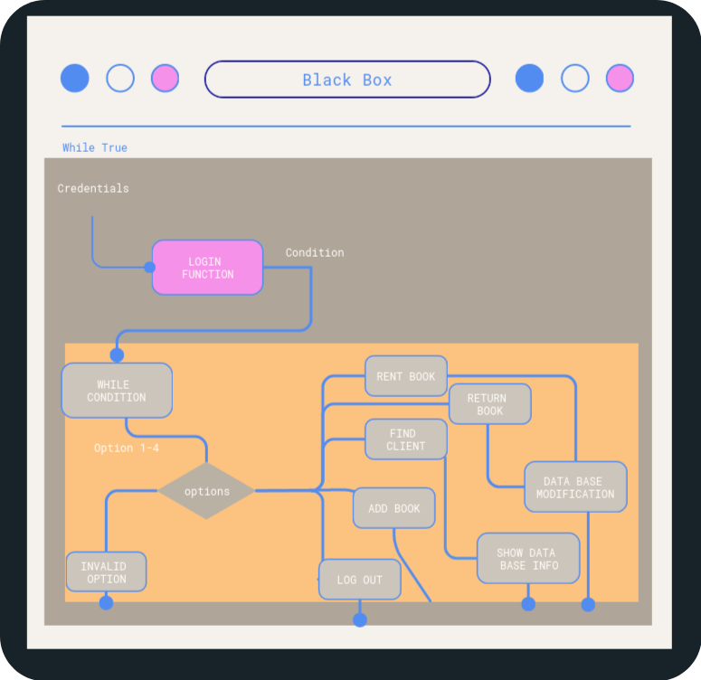
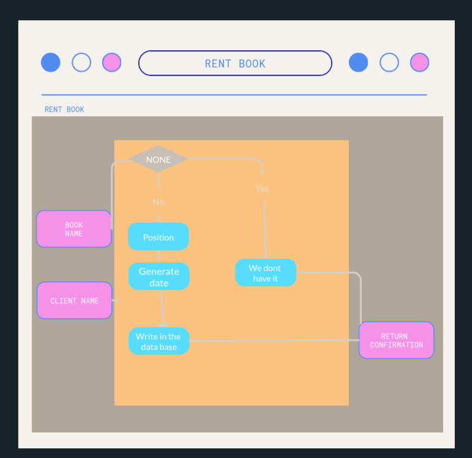

# __ CI_PP3_LIBRARY__


Code institute Project portfolio 3 Library  ** CI_PP3_LIBRARY** is a website created specifically for library workers to use. where the staff can use a console application to access the database and make adjustments like rent, return a book for a client, and get the client's information.

 

- HTML 
"HTML is the standard markup language for documents designed to be displayed in a web browser. It can be assisted by technologies such as Cascading Style Sheets (CSS) and scripting languages such as JavaScript. [[1](https://en.wikipedia.org/wiki/HTML)] "

- CSS
"Cascading Style Sheets (CSS) is a style sheet language used for describing the presentation of a document written in a markup language such as HTML.
CSS is a cornerstone technology of the World Wide Web, alongside HTML and JavaScript.[[2](https://en.wikipedia.org/wiki/CSS)]"

- JS
"JavaScript, often abbreviated JS, is a programming language that is one of the core technologies of the World Wide Web, alongside HTML and CSS. As of 2022, 98% of websites use JavaScript on the client side for web page behavior, often incorporating third-party libraries. All major web browsers have a dedicated JavaScript engine to execute the code on users' devices. .[[3](https://es.wikipedia.org/wiki/JavaScript)]"

- Python 
"Python" is a high-level, interpreted, general-purpose programming language. Its design philosophy emphasizes code readability with the use of significant indentation.
Python is dynamically-typed and garbage-collected. It supports multiple programming paradigms, including structured (particularly procedural), object-oriented and functional programming. It is often described as a "batteries included" language due to its comprehensive standard library.[[3](https://en.wikipedia.org/wiki/Python_(programming_language))]

   


[Live web page](https://ci-pp3-lib.herokuapp.com/)


## __Table of Content__

1. [Project Goals](#project-goals)
    1. [User Goals](#user-goals)
    2. [Site Owner Goals](#site-owner-goals)
2. [User Experience](#user-experience)
    1. [Target Audience](#target-audience)
    2. [User Requirements and Expectations](#user-requirements-and-expectations)
    3. [User Stories](#user-stories)
3. [Design](#design)
    1. [Design Choices](#design-choices)
    2. [Colour](#colour)
    3. [Fonts](#fonts)
    4. [Structure](#structure)
4. [Technologies Used](#technologies-used)
    1. [Languages](#languages)
    2. [Frameworks Libraries Tools](#frameworks-libraries-tools)
5. [Features](#features)
6. [Testing](#validation)
    1. [HTML Validation](#html-validation)
    2. [CSS Validation](#css-validation)
    3. [JS Validation](#js-validation)
    4. [Accessibility](#accessibility)
    5. [Performance](#performance)
    6. [Browsers support](#browsers-support)
    7. [Testing user stories](#testing-user-stories)
8. [Bugs](#bugs)
9. [Exeptions](#exeptions)
10. [Deployment](#deployment)
    1. [JSemail api method](#jsemail-api-method)
    2. [Share the code](#share-the-code)
    3. [Fork the code](#fork-the-code)
    4. [Clone the code](#clone-the-code)
11. [Credits](#credits)
12. [Contributing](#contributing)
13. [License](#license)
14. [Acknowledgements](#acknowledgements)

## __Project Goals__

### __User Goals__

- Individuals in need of library management software.
- Secure the database with credentials.
- Make use of website services.
- Make renting and returning a book for a client simple.

### __Site Owner Goals__

- Take care of a database.
- Offer customers a simple and quick service.
- An easy-to-use interface for the workers to sign up for 

## __User Experience (UXD)__

### __Target Audience__

- Patrons of libraries.
- library employees.
- proprietors of libraries.

### __User Requirements and Expectations__

- Interactive and easy to understand page design.
- A straightforward and clear navigation.
- A program that integrates with Google Sheets as a database
- Streamline the routine tasks.
- External Links referenced to developer

### __User Stories__

#### __First-time User__
First time user:

1. Wants easy operation.
2. Has a desire to provide a service to customers.
3. Desires to assist a client with renting a book.
4. Wants access to credentials so they can secure the database.
5. Media to get in touch with the creator.
6. Experience fluid interaction 

#### __Returning User__
As a returning user, We want:

7. Research details for a client.
8. Return a book to the stock from a client.
9. Reload the page to fix interface issues in the future.

#### __Site Owner__
As the site owner, we want:

10. controll data base.
11. Simple database manipulation
12. An easy way to find the developer
13. Handling an interactive console.

## __Design__

### __Design Choices__

The website was created with the knowledge that Heroku would have difficulty deploying a user interface with particular libraries, thus a console interface with a fluid design was employed entirely to give the operator the impression that they were in an interactive environment.

### __Colour__

The color tones were chosen precisely to match the concept and to a simple and approachable design using the Visual Studio colors preset.

  

<br>

### __Fonts__

ROBOTO Font from GOOGLE. 
The most used on the majority of data flow.

<br>

### __Structure__

Following the principles of UXD (user experience design), the website structure was designed to be fluid and simple to operate.
The website was composed of a page with: 

- The Terminal, a template created by the Code Institute.
- The terminal's Refresh button 
- Fotter with social media developer

### Logical Design

#### Flowchart

Flowchart consist in A black box that contains all functions is divided into 4 sections in the flowchart.
The functions are made in 3 clear boxes that serve the following 3 purposes: rent book, return book, and client information.


<details><summary>Black Box</summary>
    
</details>

<details><summary>Rent Book</summary>
        
</details>
<details><summary>Return Book</summary>
        
</details>
<details><summary>Get client information</summary>
        
</details>


## __Technologies Used__

### __Languages__

- HTML5
- CSS
- Java Script
- Python

### __Frameworks Libraries Tools__

- Visual Studio Code
- Git
- GitHub
- Gitpod
- Visme
- Google Fonts
- W3schools
- Favicon.io
- ion icons
- Gspread
- Googlesheets
- Google Drive
- Google Api

## __Features__

The page was created and influenced by old-school user interface (UI) games, where colors were blended and changed periodically to try to give users a sense of being in an antiquated setting while using contemporary visuals.

### __Navigation Bar__

Three HTML components make up the section. The first is the home page, where the user made the decision to play or read the content, the second is the contact us page, where the user can write us with their thoughts by email, and the third is the page with the instructions.
- User stories covered: 11

  

### __Cars selector__

Four different car styles made use of the car selector.
- User stories covered: 13

  

### __Difficulty level__

Difficulty consist in: Easy is five ways of automobiles, and hard is ten. These ways were used to expand or contract the stages.
- User stories covered: 13

  

### __Play the game__

This function was designed to resemble older games in which you just clicked "play" to begin the game.
- User stories covered: 13

  

### __Footer__

The footer is a straightforward part where social networking connections are made with the website in an easy-to-understand manner.
- User stories covered: 5

 

### __Form__

The form can be utilized by the user in a variety of ways, including sending feedback, reporting bugs, and sharing recommendations.
- User stories covered: 9

 

### __Form Submit__

The form submission modification was made to make the website more dynamic. The system changes the interface and displays a graphic to inform the user that the message has been sent.
- User stories covered: 9

 

### __How to play__

The instructions that describe the game's dynamics are included in this section.
with a graphic showing each interactive element in the user interface and text explaining it.
- User stories covered: 6

 

### __Game UI__

A canvas with a background of the way is part of the game's user interface. Using CSS animation, it is animated to give the impression that it is moving.
The player's EGO car and the other opponents' cars are the small components inside, and these divisions can be manipulated by JS by shifting their locations in the area.
- User stories covered: 4,2

 

### __Game controls__

The controls consist of two straightforward arrows that attempt to replicate the joystick and three buttons found on older machines.
- User stories covered: 3

 

## __Validation__

### __HTML Validation__

The Validator used was W3C Service to validate the HTML of the webpage, 
the entire project pass with no errors by use of some tools.

<details><summary>Home Validation</summary>

</details>
<details><summary>Game UI Validation</summary>

</details>
<details><summary>Contact Us Validation</summary>

</details>
<details><summary>Instructions Validation</summary>

</details>
<details><summary>404 Validation</summary>

</details>

### __CSS Validation__

W3C's primary activity is to develop protocols and guidelines that guarantee long-term growth for the Web.
W3C's  determine key parts of what makes the World Wide Web activity.
W3C was used to validate the CSS style of the whole page

<details><summary>style.css</summary>

</details>

### __JS Validation__

HintJs was used to validate the JS files, where the code was placed, the errors were rectified, and the actual unneeded variables were deleted. 
The software detects too many functions like unused variables.

<details><summary>Car and difficulty selector JS</summary>

</details>
<details><summary>Contactus JS</summary>

</details>
<details><summary>Game JS</summary>

</details>

### __Accessibility__

The WAVE WebAIM web accessibility evaluation tool was used to ensure the website met high accessibility standards. All pages pass with 0 errors.

<details><summary>Home accessibility</summary>

</details>
<details><summary>Game UI accessibility</summary>

</details>
<details><summary>Contact Us accessibility</summary>

</details>
<details><summary>Instructions accessibility</summary>

</details>
<details><summary>404 accessibility</summary>

</details>

### __Performance__

Google Lighthouse's Chrome Developer Tool was used to test the website's performance.

<details><summary>Home performance</summary>

</details>
<details><summary>Game UI performance</summary>

</details>
<details><summary>Contact Us performance</summary>

</details>
<details><summary>Instructions performance</summary>

</details>
<details><summary>404 performance</summary>

</details>

### __Browsers support__

| [](http://godban.github.io/browsers-support-badges/)<br/>IE / Edge | [](http://godban.github.io/browsers-support-badges/)<br/>Firefox | [](http://godban.github.io/browsers-support-badges/)<br/>Chrome | [](http://godban.github.io/browsers-support-badges/)<br/>Safari | [](http://godban.github.io/browsers-support-badges/)<br/>Opera |
| --------- | --------- | --------- | --------- | --------- |
| IE11, Edge| last 2 versions| last 2 versions| last 2 versions| last 2 versions

### __Testing user stories__


1. Desires simple navigation.

| **Feature** | **Action** | **Expected Result** | **Actual Result** |
|-------------|------------|---------------------|-------------------|
|Navigation Bar | change pages| Fluid design | Works as well |

<details><summary>Navigation Bar</summary>

</details>

2. Is interested in playing.

| **Feature** | **Action** | **Expected Result** | **Actual Result** |
|-------------|------------|---------------------|-------------------|
|Atractive desing | Call the atention of the user| Animations | Works as well |

<details><summary>Home design</summary>

</details>


3. Desires to play a traditional game.

| **Feature** | **Action** | **Expected Result** | **Actual Result** |
|-------------|------------|---------------------|-------------------|
|Classic desing |Transport the player to the old environment game| Animation Background | Works as well |


<details><summary>Game design</summary>

</details>

4. Desires to solicit comments or opinions.

| **Feature** | **Action** | **Expected Result** | **Actual Result** |
|-------------|------------|---------------------|-------------------|
|Form conected with email |Recibe the messages| Api jsemail | Works as well |


<details><summary>Form JSEmail</summary>

</details>

5. Is curious about social media.

| **Feature** | **Action** | **Expected Result** | **Actual Result** |
|-------------|------------|---------------------|-------------------|
|Social media links |Open the social media| open blank page with the link| Works as well |


<details><summary>Social links</summary>

</details>

6. Be familiar with the game's rules 

| **Feature** | **Action** | **Expected Result** | **Actual Result** |
|-------------|------------|---------------------|-------------------|
|Instructions | Explain the rules| Images and text| Works as well |


<details><summary>Instructions</summary>

</details>

7. be aware of the result and improve.

| **Feature** | **Action** | **Expected Result** | **Actual Result** |
|-------------|------------|---------------------|-------------------|
|Report the score| Show the score at the end| New div appear on the screen| Works as well |


<details><summary>Score</summary>

</details>

8. A website where you may unwind and play a simple game.

| **Feature** | **Action** | **Expected Result** | **Actual Result** |
|-------------|------------|---------------------|-------------------|
|Simple UI | 3 button sections| Change conditions| Works as well |


<details><summary>Simple UI</summary>

</details>

9. Offer feedback or file bug reports.

| **Feature** | **Action** | **Expected Result** | **Actual Result** |
|-------------|------------|---------------------|-------------------|
| Form Title| Message to explain it to user| Message and colors| Works as well |


<details><summary>Form message</summary>

</details>

10. Locate the page's social media accounts.

| **Feature** | **Action** | **Expected Result** | **Actual Result** |
|-------------|------------|---------------------|-------------------|
|Footer | Open links in blank page| links with social media | Works as well |


<details><summary>Footer</summary>

</details>

11. Use a website with a straightforward navigation bar.

| **Feature** | **Action** | **Expected Result** | **Actual Result** |
|-------------|------------|---------------------|-------------------|
| Navigation Bar wrapper| Put all items in a style| Wrap a List in one section| Works as well |


<details><summary>Nav Bar</summary>

</details>

12. Participants who enjoy the game.

| **Feature** | **Action** | **Expected Result** | **Actual Result** |
|-------------|------------|---------------------|-------------------|
|The Game |Dynamic game| Can move the car and can lose the game| Works as well |

<details><summary>Game</summary>

</details>

13. A responsive and interactive page that is clear.

| **Feature** | **Action** | **Expected Result** | **Actual Result** |
|-------------|------------|---------------------|-------------------|
| Fit the page to different screens | Fit content and style| Change dynamic sizes| Works as well |

<details><summary>Responsive PC</summary>

</details>

<details><summary>Responsive Phone</summary>

</details>

14. Simple method for contacting us and providing feedback.

| **Feature** | **Action** | **Expected Result** | **Actual Result** |
|-------------|------------|---------------------|-------------------|
|Submit method to send the form | Submit| Recibe at email| Works as well |

<details><summary>Emailjs</summary>

</details>

15. Give the players a sense of being in a traditional setting.

| **Feature** | **Action** | **Expected Result** | **Actual Result** |
|-------------|------------|---------------------|-------------------|
| Almost all pictures are similar to classic games|Use pictures to decorate all| Images and text| Works as well |

<details><summary>Environment</summary>

</details>

## __Bugs__

| **Bug** | **Fix** |
| ----------- | ----------- |
| Footer doesn't stay down | change position and HTML min size |
| Contrast errors | was used animated colors to fix it |
| Use different cars, they didn't appear | Set a default option|
| Jshint detect function like unussed variables| Call them with event listener|
## __Exeptions__

In Game.html was putted a script in the header for jsemail because, The mail doesn't work if the script is not in  there.

## __Deployment__

### JSEMAIL API method

1. Open a profile at emailjs.com
2. Add a new email service; the code will utilize the contact service ID
3. Include a new email template; the code will use the contact form ID.
4. In the integration dashboard, your user ID will be displayed.
5. Make sure to load the EmailJS SDK in the head of your HTML code; otherwise, it won't work.
6. In JavaScript, write a method that initializes the SDK with your ID and waits for submit events; depending on the version, this may change.

### Share the code

The steps for using GitHub Pages to deploy the website were as follows:

1. On the GITHUB page's repository settings.
2. On the menu under the Pages heading for code and automation.
3. Select the primary branch in the source's selector..
4. If everything that came before done so, you can see Your "link" has been published on your website..

### Fork the code

To fork the repository:

1. On the GitHub repository.
2. Press the fork button in the top right corner.

### Clone the code

To clone the repository:
- In the Github repository
1. Locate the button __Code__ in the right uper corner. 
2. Chose between HTTPS, SSH, Github CLI or download zip.
3. Open Git Terminal (Bash).
4. Go to the directory where you want to cloned the file.
6. Use command Git clone and paste the URL.
```bash
git clone https://github.com/jdhernandezS1/CI_PP2_CG.git
```   
Online view [link_to_page](https://jdhernandezs1.github.io/CI_PP2_CG/)
## __Credits__

- Google apis for fonts and maps : fonts.googleapis.com
- icons source : https://ionic.io/ionicons
- https://www.w3schools.com  
- https://www.freepng.es

### __Media__
Images Sources:
- fabicons
- freepng
- ionicons

### __Information__

-  Road fighter 8 bit was the inspiration.

### __Code__
In order how was used:

- GITHUB to create the repository.
- Visual Studio Code by develop the HTML, CSS and JS files.


#### __Built With__

The softwares language and recomended IDE used to build the project.

* [HTML](https://www.w3schools.com/html/)
* [CSS](https://www.w3schools.com/css/default.asp)	
* [JS](https://en.wikipedia.org/wiki/JavaScript)
* [visual studio code](https://visualstudio.microsoft.com/es/)
* [Git](https://git-scm.com/)
* [GitHub](https://github.com/)


## __Contributing__

Please read through our contributing guidelines, every pull request has been notified to be able to push code included 
- directions for opening issues
- coding standards
- notes on development
## __License__

- CI_PP2_CG is an open source project by [CI_PP2_CG](https://github.com/jdhernandezS1/CI_PP2_CG) that is licensed under [ops](https://opensource.org/).
- CI_PP2_CG reserves the right to change the license of future releases.

## __Acknowledgements__

Cordially thanks to: 

- HashEm to bless me.
- My mentor Mo Shami for his support and Professional advices.
- My Family to support me.
- Guys of Stack overflow.


This is the Code Institute student template for deploying your third portfolio project, the Python command-line project. The last update to this file was: **August 17, 2021**

